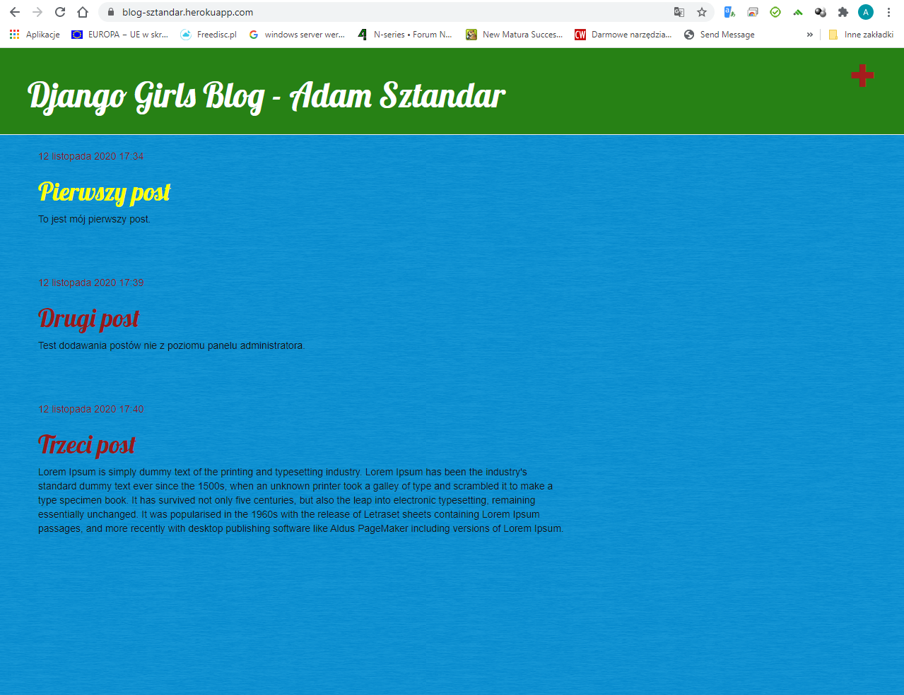
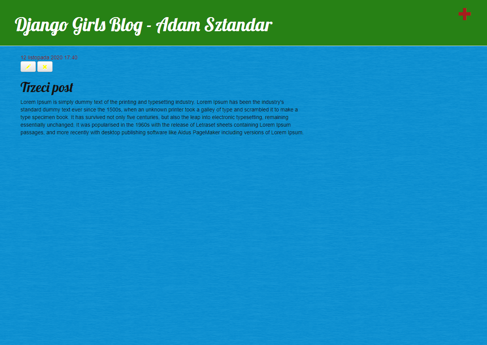
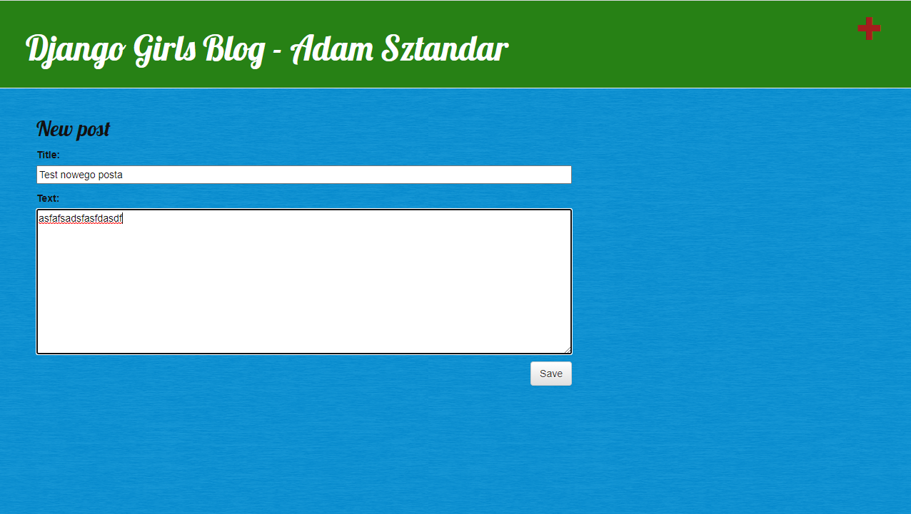
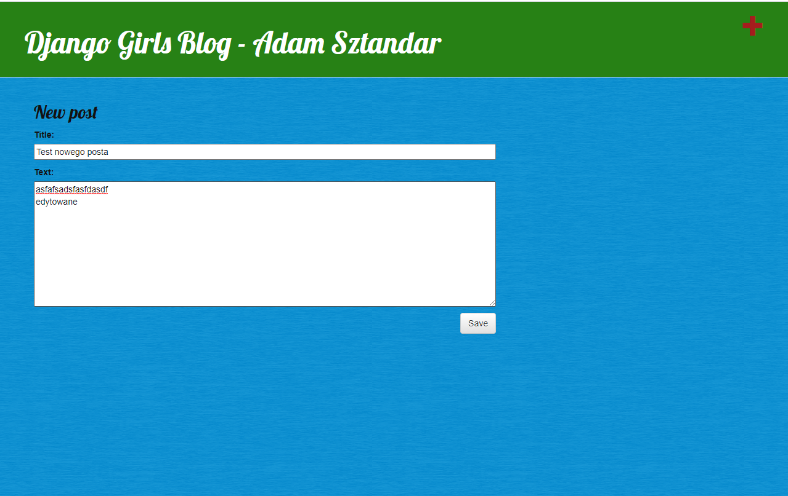
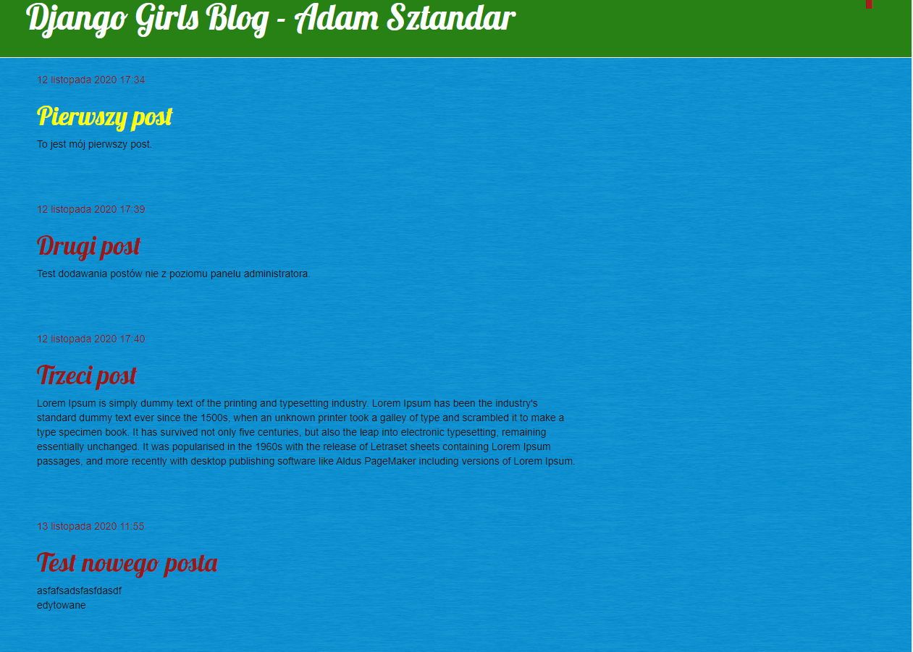
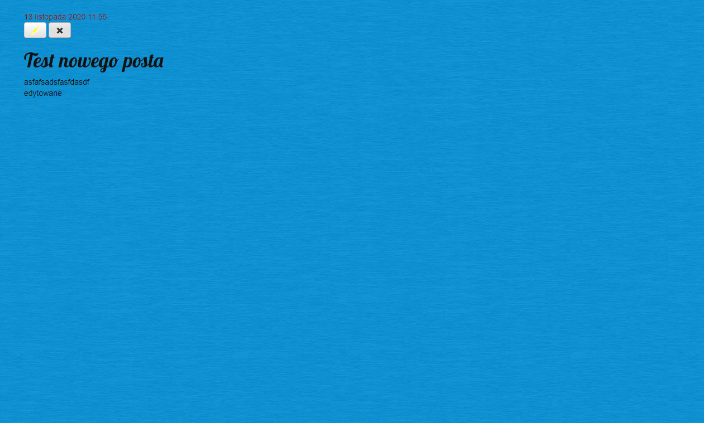
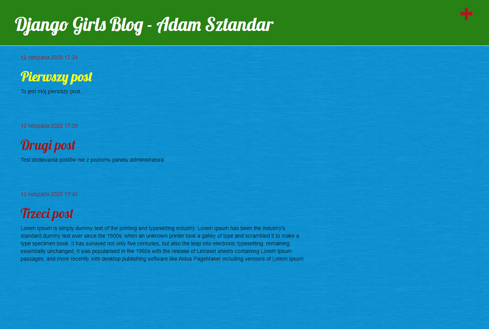

# aplikacje-internetowe-sztandar_adam-185ic

### Wykorzystane technologie.
* HTML5
* Bootstrap
* CSS
* Django
* Heroku

### Przedstawienie rezultatów.
__Strona główna__ - strona bloga wraz z wpisami.

__Post__ - strona zawierająca poszczególny post.

__Dodawanie posta__ - strona zawierająca formularz dodawania nowego posta.

__Edytowanie posta__ - strona zawierająca formularz edycji posta.

__Usuwanie posta__ - usunięcie posta po kliknięciu w przycisk.

__Strona główna jak nie jesteśmy zalogowani__ - strona bloga wraz z wpisami bez logowania.
![Strona Główna](md_img/8.png