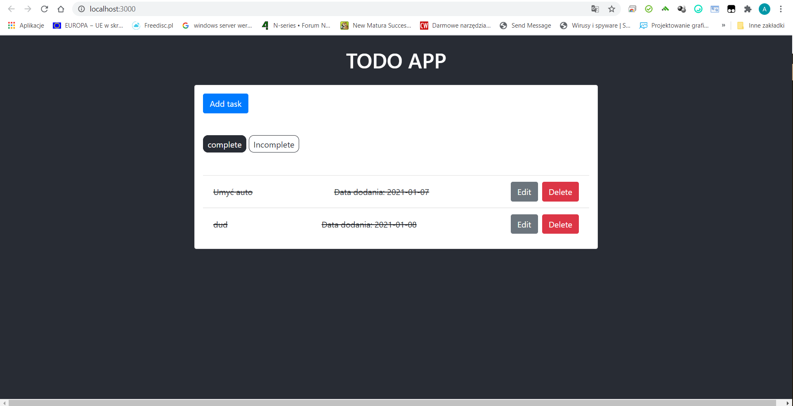
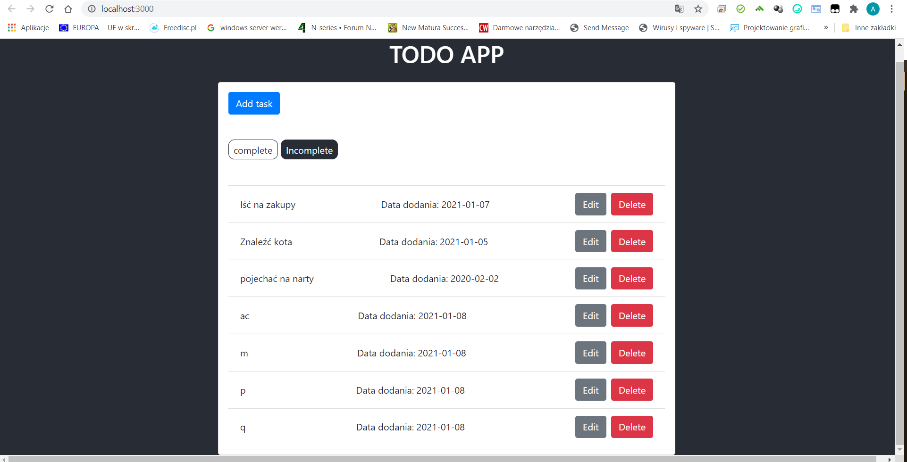
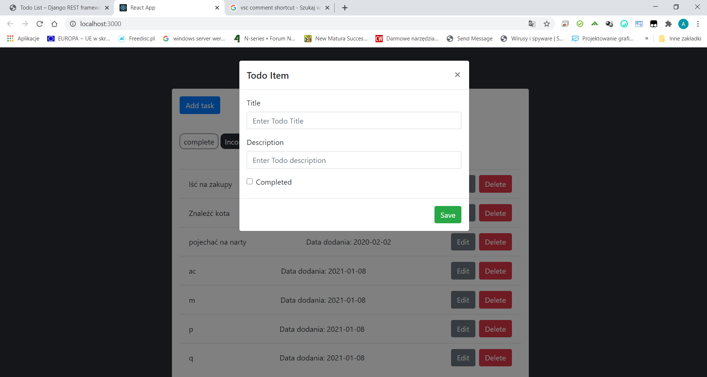
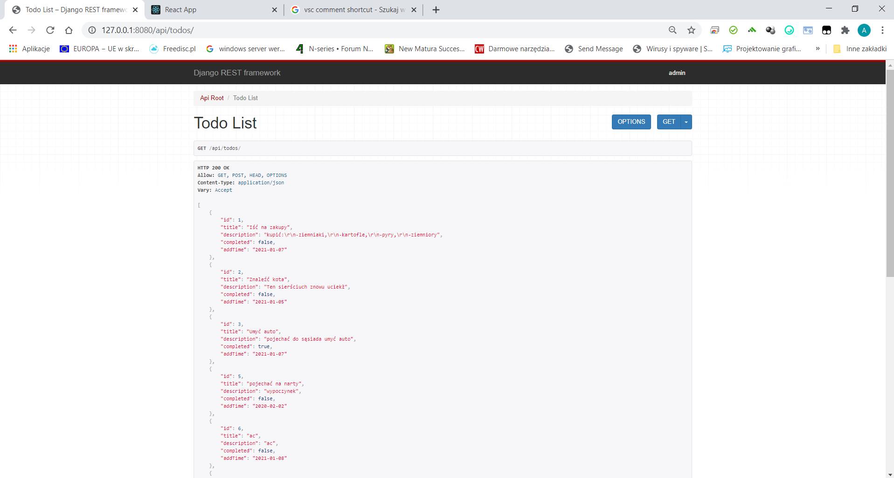

# aplikacje-internetowe-sztandar_adam-185ic

##lab10

### Wykorzystane technologie.
* Django
* DRF
* REACT

### Przedstawienie rezultatów.
__Complete__ :  
  

__Incomplete__ :  
  

__Add new task__ :  

__DRF__ :  
  

Projekt jest na tyle dobrze zrobiony że nie miałem pomysłu co dodatkowo mógłbym dodać. Jedyne co przyszło mi do głowy to dodanie daty dodania zadania.
Jest ona pobierana bez ingerencji użytkownika tak aby dane były poprawnie wprowadzone. Data ta jest zapisywana również w API.  
# Wszystkie pkt zostały zrealizowane.  

