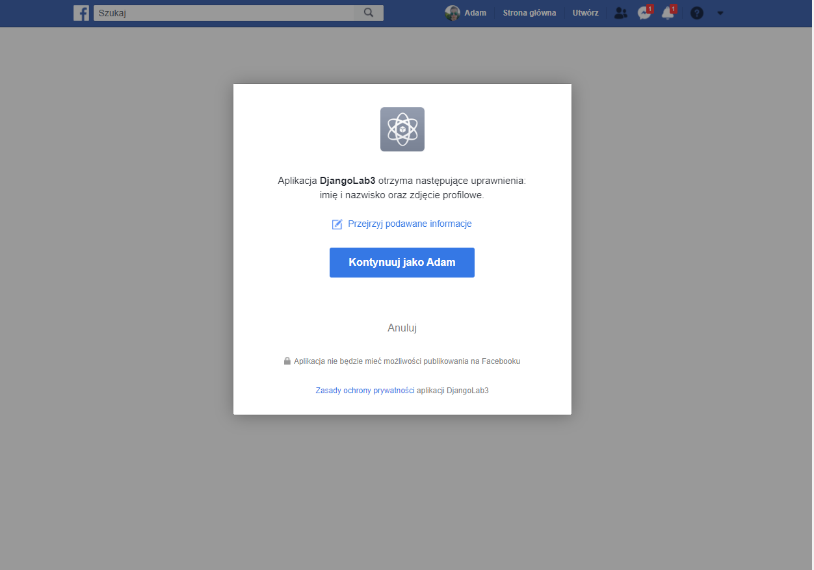

# aplikacje-internetowe-sztandar_adam-185ic

### Wykorzystane technologie.
* HTML5
* Bootstrap
* CSS
* Django
* Heroku

### Przedstawienie rezultatów.
__Strona główna__ -

__Logowanie przez github__ - 

__Logowanie przez fb__ - 

