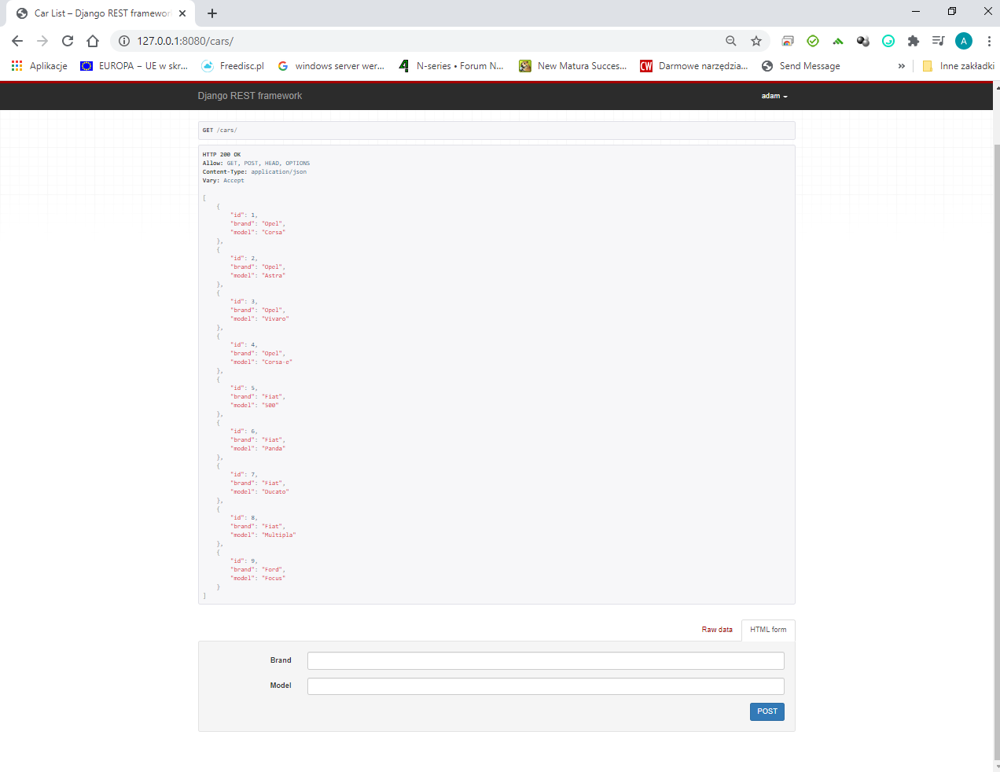

# aplikacje-internetowe-sztandar_adam-185ic

### Wykorzystane technologie.
* Django
* DRF
* SWAGGER

#### Zwróćmy uwagę na zalogowanego i niezalogowanego użytkownika. 
#### Jeżeli nie jesteśmy zalogowani to możemy jest tryb READONLY

### Przedstawienie rezultatów.
__Strona główna__ -

__Dane__ -

__Logowanie__ -

__Widok zalogowanego użytkownika__ -

__SWAGGER__ -

__GET jako użytkownik zalogowany__ -

__POST jako użytkownik zalogowany__ -

__DELETE jako użytkownik zalogowany__ -

__POST jako użytkownik NIEZALOGOWANY__ -

