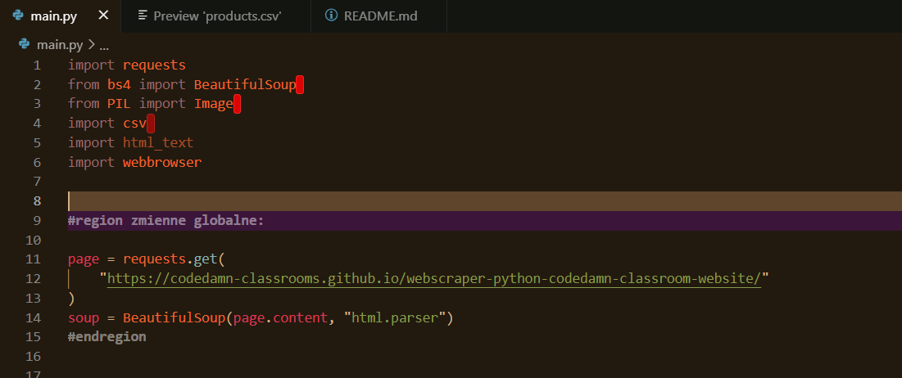
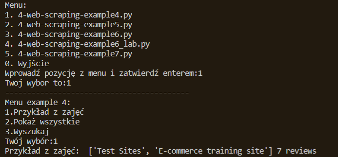
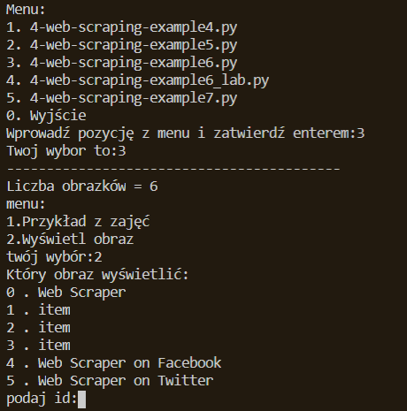

# aplikacje-internetowe-sztandar_adam-185ic

### Wykorzystane technologie.
*Python
*BeautifulSoup

## Importy oraz zmienne globalne:
__import i zmienne globalne__ :

__uruchomienie programu__:

##przykład: 4-web-scraping-example4.py 
__4-web-scraping-example4.py__ -

##przykład: 4-web-scraping-example5.py 
__4-web-scraping-example5.py__ -

##przykład: 4-web-scraping-example6.py 
__4-web-scraping-example6.py__ -

Obrazek by powinien zostać wyświetlony w domyślnym programie do wyświetlania obrazów.

##przykład: 4-web-scraping-example6lab.py 
__4-web-scraping-example6lab.py__ -

##przykład: 4-web-scraping-example7.py 
__4-web-scraping-example7.py__ 

Z własnych modyfikacji dodałem między innymi menu do przykładów, menu podprzykładów, otwieranie linków, obrazów 
Dzięki web scrapingu możemy pobrać zawartość paru stron i utworzyć zbiór przydatnych dla nas elementów które poźniej można wykorzysać.

