# aplikacje-internetowe-sztandar_adam-185ic

##lab6

### Wykorzystane technologie.
* Django
* DRF 

### Przedstawienie rezultatów.
__viewset__ :
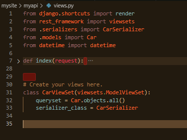

__routers__ :
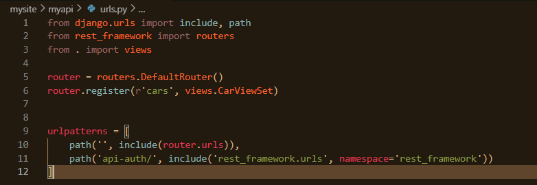

__uwierzytelnienia__ :
Basic
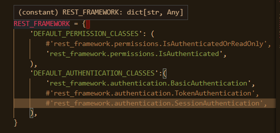
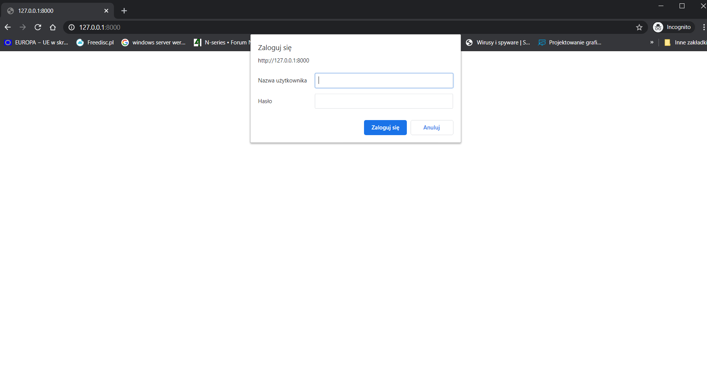
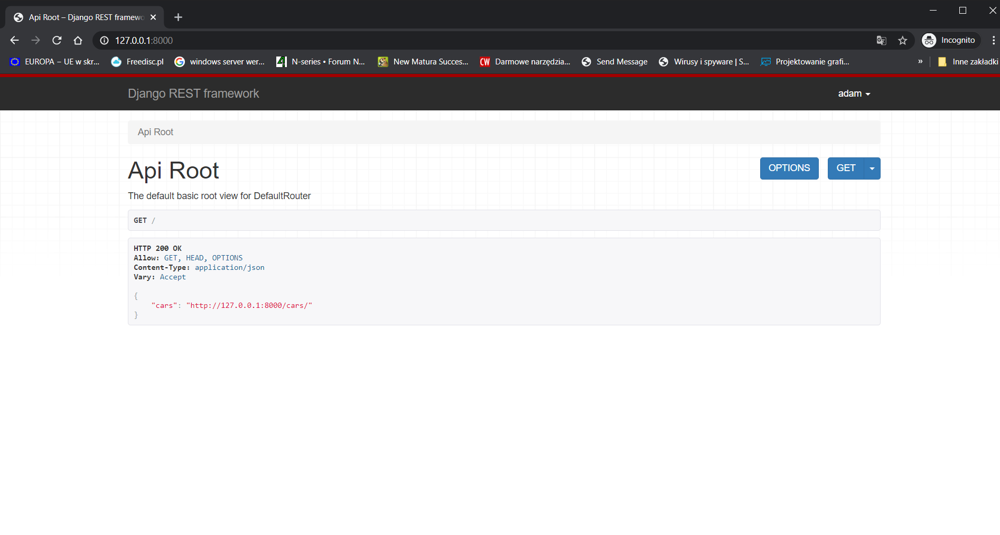

Session
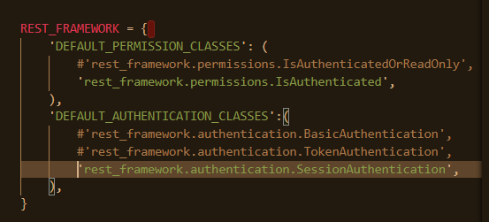
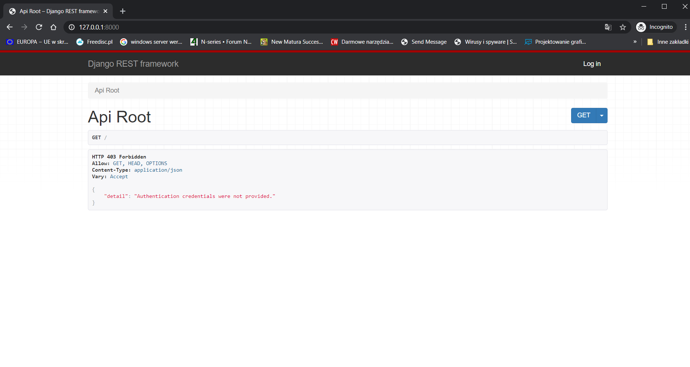
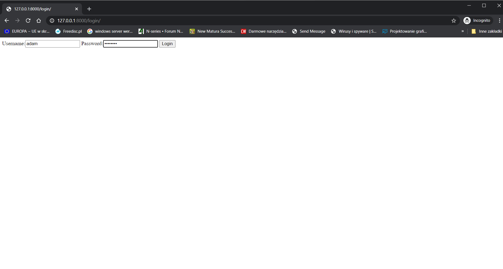
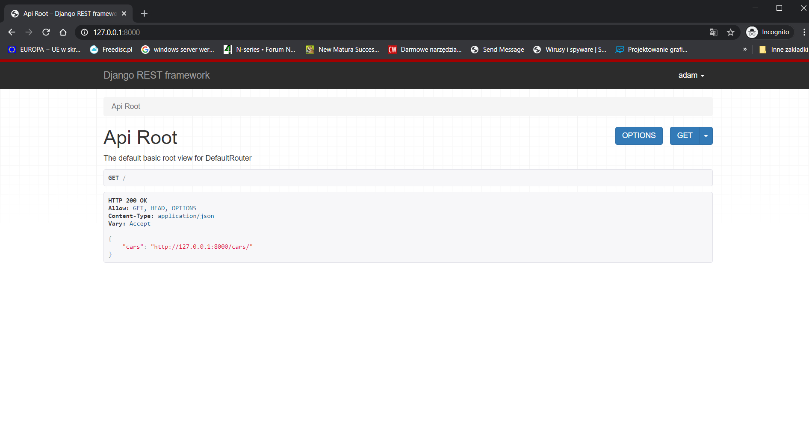

Token
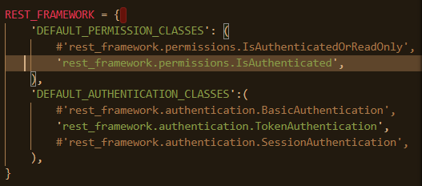
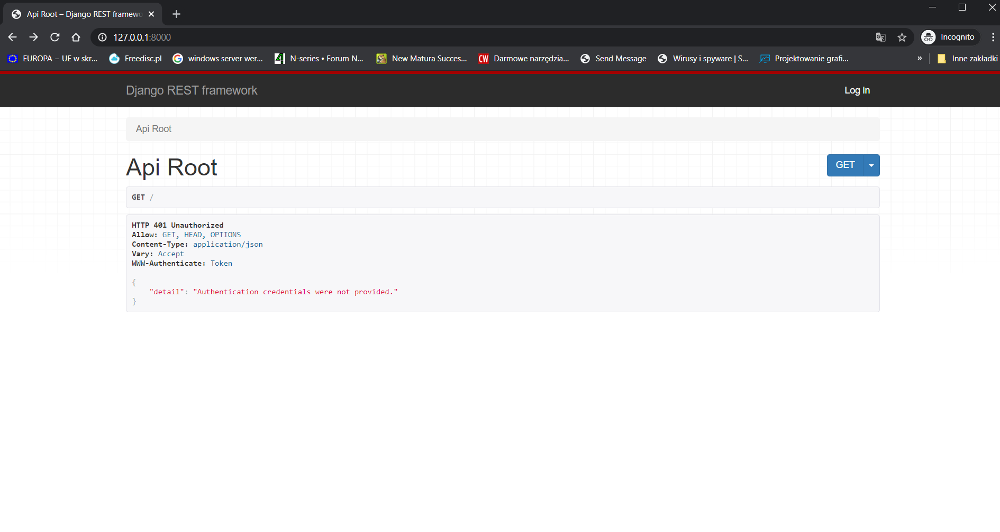
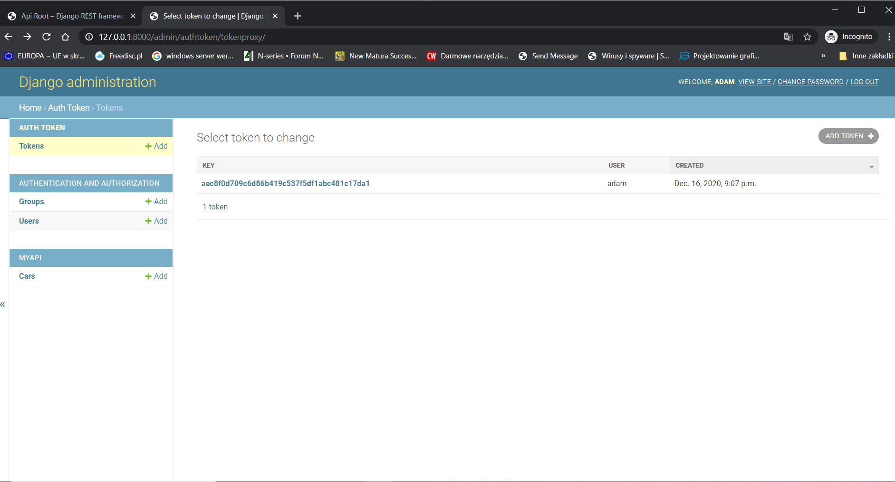

__licznik__ :
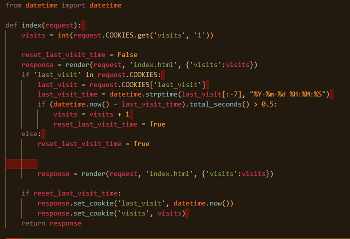
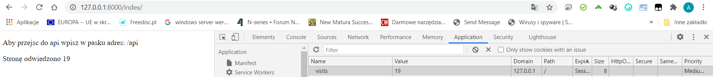

Licznik jest ustawiony na 0.5 sekundy aby można było zobaczyć efekt.

# Jest to nowe api, sam wszystko tworzyłem. 
# Wszystkie pkt zostały zrealizowane.

