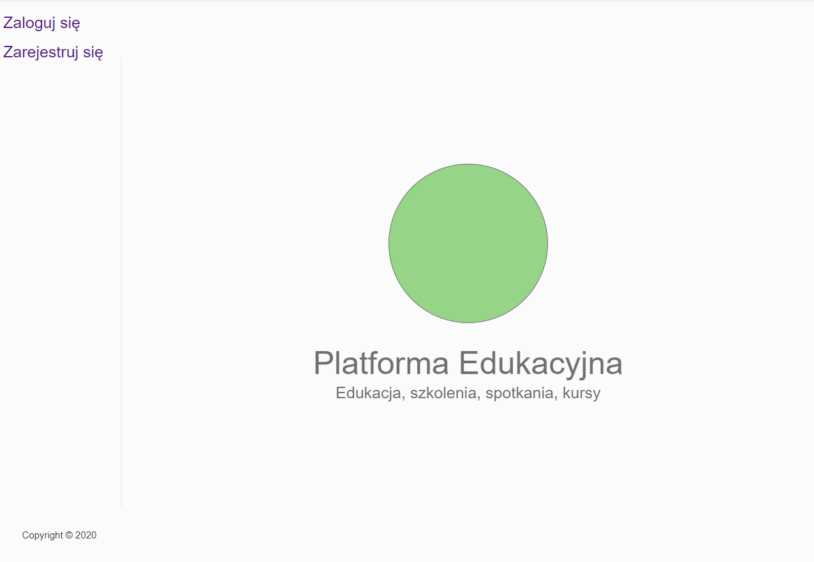

# Lab 7, 8, 9

Praca ta spełnia wymagania każdej ze wspomnianych trzech laborek
 * **Lab 7**: python + redis + Django -- w naszym przypadku JavaScript + MongoDb + Node.js
 * **Lab 8**: czat z użyciem django channels -- w naszym przypadku to po prostu web socket. czat będziemy też robić ale mozemy już pokazac odbiór zdarzen i emity (tak działą czat)
 * **Lab 9**: Django + React -- w naszym przypadku Node.js + Gatsby

## Podgląd działania:

